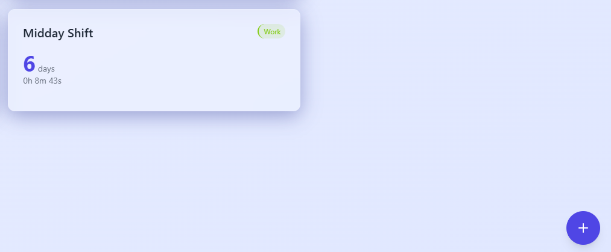
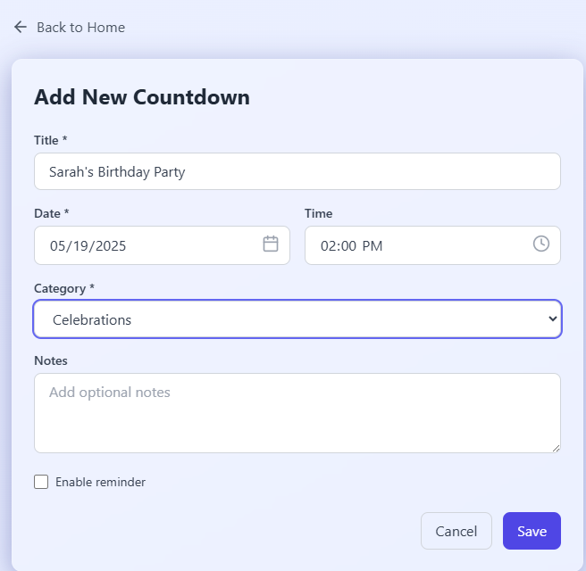
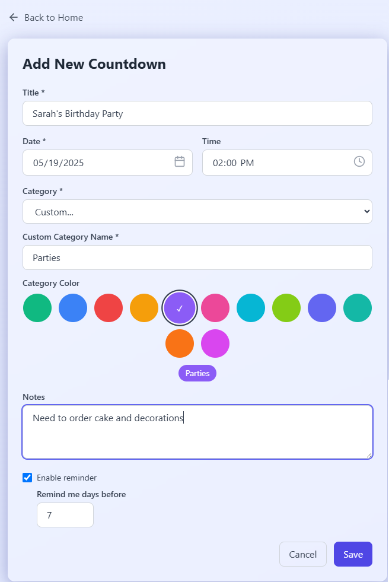
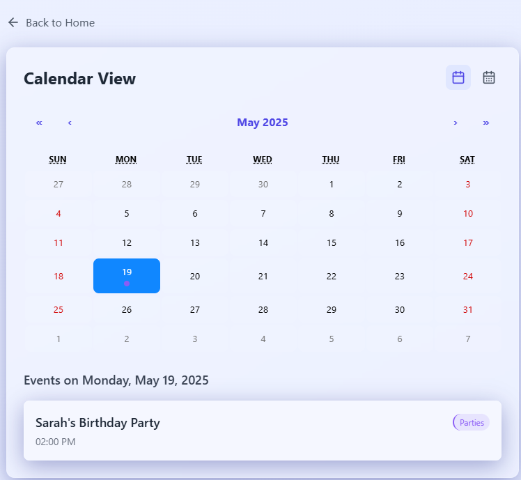
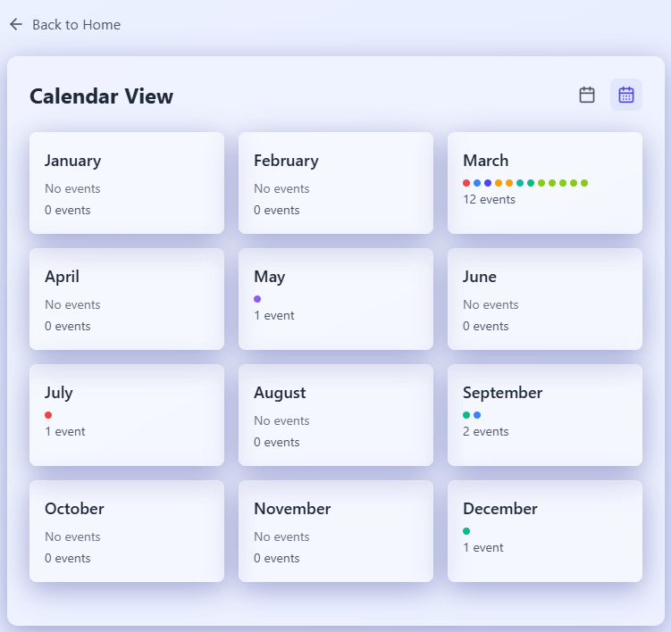

# Countdown Vibes - User Guide

Welcome to Countdown Vibes! This guide will help you make the most of your countdown management experience.

## Table of Contents
- [Getting Started](#getting-started)
- [Example: Creating a Birthday Event](#example-creating-a-birthday-event)
- [Home Screen](#home-screen)
- [Creating a Countdown](#creating-a-countdown)
- [Managing Countdowns](#managing-countdowns)
- [Calendar Views](#calendar-views)
- [Categories](#categories)
- [Settings](#settings)
- [Dark Mode](#dark-mode)
- [Notifications](#notifications)

## Example: Creating a Birthday Event

Let's walk through creating and viewing an event with a custom category, using a birthday party as an example.

### Step 1: Start New Event

*Home screen showing the "+" button to create a new event*

### Step 2: Enter Event Details
1. Fill in the basic information:
   - Title: "Sarah's Birthday Party"
   - Date: [Select a date 2 months ahead]
   - Time: 2:00 PM

*Event creation form showing title, date, and time fields*

2. Create a custom category:
   - Select "Custom" from category dropdown
   - Enter "Parties" as the new category
   - Choose purple color (#8b5cf6)
   - Enable reminder for 7 days before
   - Add note: "Need to order cake and decorations"

*Custom category creation with color picker and reminder settings*

### Step 3: View in Calendar
#### Monthly View
Navigate to the calendar to see your event:

*Monthly view showing the purple dot for the birthday party event*

#### Yearly View
Switch to yearly view to see the event in the annual context:

*Yearly view showing the month with the birthday party event*

## Getting Started

When you first open Countdown Vibes, you'll see the home screen with:
- A "+" button to add new countdowns
- Calendar and Settings icons in the header
- Category filters at the top
- A search bar to find specific countdowns

## Home Screen

### Search
- Use the search bar to find countdowns by title or notes
- Results update instantly as you type

### Category Filtering
- Click category buttons to filter countdowns
- "All" shows every countdown
- Each category has its own color indicator

## Creating a Countdown

1. Click the "+" button on the home screen
2. Fill in the countdown details:
   - **Title** (required): Name your countdown
   - **Date** (required): Select the target date
   - **Time** (optional): Set a specific time
   - **Category**: Choose existing or create custom
   - **Notes** (optional): Add additional information
   - **Reminder** (optional): Enable notifications

### Custom Categories
1. Select "Custom" from the category dropdown
2. Enter a new category name
3. Choose a color for the category
4. The new category will be available for future countdowns

## Managing Countdowns

### Viewing Details
- Click any countdown to see its full details
- View remaining time in days, hours, minutes, and seconds
- See category, notes, and reminder settings

### Editing
1. Open a countdown's details
2. Click the edit (pencil) icon
3. Modify any fields
4. Save your changes

### Deleting
1. Open a countdown's details
2. Click the delete (trash) icon
3. Confirm deletion

## Calendar Views

### Month View
1. Click the calendar icon in the header
2. Navigate between months using arrows
3. Events are shown with category-colored dots
4. Click any date to see its events

### Year View
1. Click the calendar-days icon in the calendar view
2. See all months at once
3. Each month shows:
   - Total number of events
   - Category-colored dots for events
   - "No events" if empty
4. Click any month to zoom in

## Categories

### Predefined Categories
- Celebrations (Green)
- Milestones (Blue)
- Deadlines (Red)

### Custom Categories
- Create while adding/editing countdowns
- Choose from 12 different colors
- Manage in Settings

### Managing Categories
1. Go to Settings
2. Scroll to "Category Management"
3. View all categories
4. Delete unused custom categories
   - Cannot delete predefined categories
   - Cannot delete categories in use

## Settings

### Theme Settings
- Toggle between light and dark mode
- Settings persist between sessions

### Notification Settings
- Enable/disable browser notifications
- Set reminder days before events
- Manage notification permissions

### Category Management
- View all categories
- Delete unused custom categories
- See which categories are predefined

## Dark Mode

1. Access Settings
2. Find the Theme section
3. Click the sun/moon icon to toggle
4. UI updates instantly

## Notifications

### Setup
1. Go to Settings
2. Enable notifications
3. Allow browser permissions when prompted

### Reminder Settings
When creating/editing a countdown:
1. Enable "Reminder"
2. Set number of days before event
3. Save settings

### Receiving Notifications
- Browser notifications appear at set times
- Click notification to view countdown
- Must keep browser notifications enabled

## Tips & Tricks

1. **Quick Access**
   - Use search for instant countdown finding
   - Use category filters for better organization

2. **Calendar Navigation**
   - Switch between month/year views for different perspectives
   - Click dates/months to drill down to details

3. **Category Organization**
   - Use distinct colors for different types of events
   - Create custom categories for better organization

4. **Efficient Management**
   - Delete unused categories to keep organized
   - Use notes for additional event details
   - Set reminders for important events

## Troubleshooting

### Notifications Not Working
1. Check browser notification permissions
2. Ensure notifications are enabled in Settings
3. Verify reminder days are set for the countdown

### Category Cannot Be Deleted
- Check if category is predefined
- Check if any countdowns use this category

### Calendar View Issues
- Try switching between month/year views
- Refresh the page if events don't appear

Need more help? Contact support or check our GitHub repository for updates. 